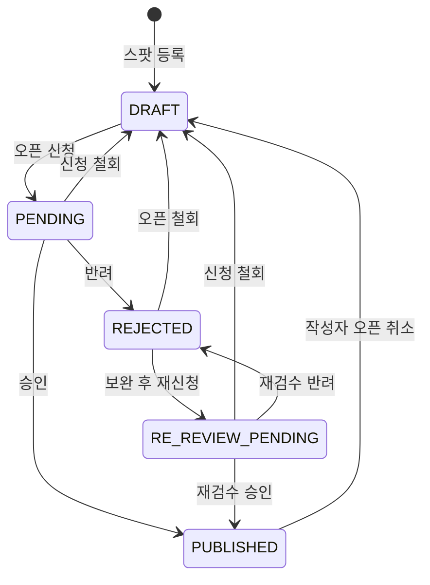
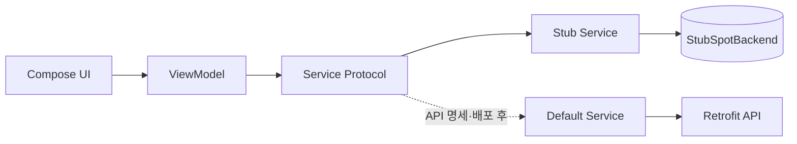

# PV-41 — 상태 모델과 API 계약

## 구현 단계

| 단계 | 구현 | 완료 조건 |
| --- | --- | --- |
| Stub UI | 도메인·Service 인터페이스, `StubSpotBackend`, Stub Service, ViewModel, UI | 모든 상태·성공·실패·경합 시나리오가 로컬에서 재현됨 |
| API Contract | 아래 및 기능별 API 계약 입력란 작성 | endpoint, param, body, response, error code 확정 |
| Integration | Retrofit DTO/API, Mapper, `Default*Service`, Hilt 바인딩 전환 | Stub과 동일한 ViewModel/UI 테스트 + API mapper/service 테스트 통과 |

UI와 ViewModel은 Stub/Default 구현체를 알지 못하며 Service 인터페이스만 사용한다.

## 상태 모델

| 서버 상태 | 앱 표시 | 공개 여부 | 작성자 상세 액션 |
| --- | --- | --- | --- |
| `DRAFT` | 나만보기 | 비공개 | 내 스팟 오픈하기 |
| `PENDING` | 검수중 | 비공개 | 신청 철회하기 |
| `RE_REVIEW_PENDING` | 검수중 | 비공개 | 신청 철회하기 |
| `REJECTED` | 반려 | 비공개 | 오픈 철회하기 / 내용 보완해서 다시 신청하기 |
| `PUBLISHED` | 오픈 | 공개 | 오픈 취소하기 / 추천 / 삭제 |

`PENDING`과 `RE_REVIEW_PENDING`은 UI 문구만 같고 서버 상태는 구분해 보존한다.



- 오픈 취소는 어드민 승인 취소와 별개의 작성자 기능이다.
- `PUBLISHED → DRAFT → PENDING → PUBLISHED` 이후에도 기존 추천·북마크 메타데이터를 복원한다.
- 삭제는 상태 전이가 아닌 별도의 영구 삭제 명령이다.

## 현재 코드와 변경점

| 책임 | 현재 위치 | 변경 |
| --- | --- | --- |
| 상태 도메인 | `core/services/protocols/MySpot.kt` | `DRAFT`, `RE_REVIEW_PENDING` 추가 |
| 목록·등록 DTO | `core/network/dto/myspot/MySpotDtos.kt` | 등록 기본 상태를 `DRAFT`로 변경 |
| 상태 매퍼 | `core/network/mapper/MySpotMapper.kt` | 다섯 상태를 명시적으로 매핑하고 알 수 없는 상태는 계약 오류 처리 |
| MY 스팟 API | `core/network/api/MySpotApi.kt` | 상세·신청·철회·반려 철회·재신청·오픈 취소·삭제 추가 |
| MY 스팟 서비스 | `core/services/protocols/MySpot.kt`, `core/services/impl/DefaultMySpotService.kt` | UI용 상태 명령과 편집 상세 제공 |
| 공개 상세 | `SpotDetail.kt`, `SpotDetailDto.kt`, `SpotMapper.kt` | 출처·상태·반려 사유·추천·결과 확인 필드 추가 |
| 비공개 북마크 | `SavedSpot.kt`, `BookmarkDtos.kt`, `BookmarkMapper.kt` | 운영 삭제와 작성자 비공개를 별도 상태로 표현 |

현재 등록은 `PENDING`을 기본값으로 가정하므로 V2 서버 오픈 전에 도메인·DTO·테스트를 함께 변경한다.

## 스텁 구조



- `StubSpotBackend`는 `@Singleton`으로 두어 상세·지도·리스트·보관함 Stub Service가 같은 스팟 상태를 공유한다.
- 초기 fixture에는 각 상태별 스팟, 큐레이션 스팟, 공개 유저 스팟, 비공개 북마크를 포함한다.
- 요청 지연, 일반 실패, 철회/검수 경합, 추천 실패를 결정적으로 발생시킬 수 있는 개발·테스트 시나리오를 제공한다.
- Stub Service도 실제 Service 인터페이스와 같은 최종 상태·최종 추천 수를 반환한다.
- API 연동 시 ViewModel과 Composable을 변경하지 않고 `ServiceModule` 바인딩과 네트워크 구현만 교체한다.

## 클라이언트 서비스 인터페이스

구체 HTTP 경로와 DTO 명칭은 서버 계약에 맞추되 서비스 계층은 다음 동작을 제공한다.

```kotlin
interface MySpotService {
    suspend fun list(page: Int, coordinates: Coordinates? = null): MySpotPage
    suspend fun detail(spotId: Long): MySpotDetail
    suspend fun create(draft: SpotDraft, image: ImagePayload): CreateMySpotResult
    suspend fun requestOpen(spotId: Long): MySpotTransitionResult
    suspend fun withdrawRequest(spotId: Long): MySpotTransitionResult
    suspend fun withdrawRejection(spotId: Long): MySpotTransitionResult
    suspend fun reviseAndResubmit(
        spotId: Long,
        draft: SpotDraft,
        replacementImage: ImagePayload?,
    ): MySpotTransitionResult
    suspend fun cancelOpen(spotId: Long): MySpotTransitionResult
    suspend fun delete(spotId: Long)
}

interface RecommendationService {
    suspend fun recommend(spotId: Long): RecommendationResult
    suspend fun cancel(spotId: Long): RecommendationResult
}
```

상태 변경 응답은 `spotId`, 최종 `status`, 서버 갱신 시각을 포함한다. 추천 응답은 최종 추천 수와 현재 사용자의 추천 여부를 포함한다.

## 서버 선행 계약

| 항목 | 필요한 계약 |
| --- | --- |
| 상태값 | 다섯 상태의 정확한 wire 값 |
| 동시 처리 | 철회와 승인/반려 경합 오류 코드, 최신 상태 응답 여부 |
| 반려 상세 | 반려 사유, 편집 필드, 기존 이미지 유지 방식 |
| 출처 | 큐레이션 소스 코드·표시명과 유저 등록 구분 |
| 추천 | 등록·취소 endpoint, 멱등성, 최종 카운트 응답 |
| 북마크 | 운영 삭제와 작성자 비공개를 구분하는 필드 |
| 검수 결과 | 미확인 결과 조회·확인 완료·처리 중 신청 존재 여부 |
| 승인 모달 | 승인 완료 모달 확인 여부 저장 위치 |
| 탈퇴 | 공개 스팟·추천 보존 및 재가입 복구 계약 |

임의 endpoint와 오류 코드를 클라이언트에서 먼저 확정하지 않는다.

## 공통 API 계약 입력란

기능별 문서의 표를 채우기 전에 다음 공통값을 확정한다.

| 항목 | 확정값 |
| --- | --- |
| Base URL / API version | `TBD` |
| 인증 방식 | `TBD` |
| 공통 response envelope | `TBD` |
| 공통 error envelope | `TBD` |
| 날짜·시간 형식 / timezone | `TBD` |
| 페이지 번호 기준 / page size | `TBD` |
| 상태 동시성 방식(version, updatedAt 등) | `TBD` |

기능별 API 표에는 추측값을 넣지 않는다. 서버 명세가 나오면 `TBD`를 실제 계약으로 교체하고 OpenAPI 또는 백엔드 문서 링크를 함께 기록한다.

### API 계약 작성 규칙

- **Endpoint**: HTTP method와 전체 versioned path
- **Path/Query Param**: 이름, 타입, nullable, 기본값, validation
- **Request Body**: Content-Type과 JSON/multipart 예시
- **Response**: 성공 status code, envelope, 필드 타입과 nullable
- **Errors**: HTTP status, 서비스 error code, 발생 조건, 앱 처리
- **Idempotency/Concurrency**: 중복 요청과 검수 경합 처리 방식
- **Integration Status**: `TBD` → `SPEC_READY` → `IMPLEMENTED` → `VERIFIED`

## 오류·동시성 원칙

- 상태 변경 요청 중 버튼을 비활성화한다.
- 실패 시 `실패했어요, 다시 시도해주세요`를 표시하고 직전 상태를 유지한다.
- 철회와 검수 처리가 경합하면 `이미 처리된 신청이에요`를 표시하고 상세를 강제 재조회한다.
- 화면 복귀, 앱 foreground 복귀, 결과 알림 진입 시 서버 상태를 재조회한다.
- 비공개 상세에 접근한 타 사용자에게 목록 또는 지도 복귀를 안내한다.
