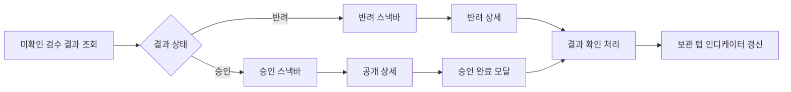

# PV-41 — 검수 결과 알림

## 디자인 참조

- [보관 탭 인디케이터·스낵바·승인 완료 모달](https://www.figma.com/design/WLGPjrQtLqyhq46zXxvXHp/DDD-design-%EC%B0%90?node-id=686-7273&p=f&t=7jXFETjPNUTJ0bx2-11)

> 구현 전 Figma MCP로 프레임 내부의 인디케이터, 승인·반려 스낵바, 승인 완료 모달 노드를 각각 확인한다.

## 결과 안내

- 지도 또는 리스트 화면에서 확인하지 않은 최신 검수 결과를 스낵바로 표시한다.
- 승인 스낵바는 **바로가기** 액션으로 공개된 상세를 연다.
- 반려 스낵바는 **확인하기** 액션으로 반려 상세를 연다.
- 액션 진입 전에 대상 스팟의 최신 상태를 조회한다.

## 보관 탭 인디케이터

- 검수 신청이 진행 중이거나 확인하지 않은 결과가 있으면 하단 **보관** 탭 아이콘에 인디케이터를 표시한다.
- 결과를 확인하기 전까지 유지한다.
- 보관 탭 진입만으로 결과를 모두 확인 처리하지 않는다. 결과 스낵바 액션 또는 대상 상세 확인 시 서버 계약에 따라 확인 완료 처리한다.

## 승인 완료 모달

- 승인 후 작성자가 해당 상세에 처음 진입하면 **스팟 오픈 완료** 모달을 한 번 표시한다.
- 모달 표시 여부는 여러 기기에서도 일관되도록 서버 확인 상태를 우선한다.
- 모달을 닫은 뒤 확인 완료를 기록하며 실패하더라도 상세 이용을 막지 않는다.

## 데이터 흐름

## 파일 매핑

| 파일 | 변경 |
| --- | --- |
| 신규 검수 결과 서비스 또는 `MySpotService` 확장 | 미확인 결과·처리 중 신청 조회, 결과 확인 완료 |
| `feature/home/HomeScreen.kt` | 보관 탭 인디케이터와 전역 스낵바 표시 |
| `feature/map/HomeMapScreen.kt` | 결과 스낵바가 지도 UI와 겹치지 않게 host 연결 |
| `feature/spotlist/SpotListScreen.kt` | 리스트 모드에서도 같은 스낵바 host 사용 |
| `app/navigation/HomeTabRequest.kt` | 보관 탭·특정 상세 이동 요청 전달 |
| `feature/spotdetail/SpotDetailScreen.kt` | 승인 완료 첫 진입 모달과 확인 완료 처리 |

## 구현 — 목록 status 대조 (2026-09-04)

**검수 결과 전용 엔드포인트는 서버에 없다**(2026-08-26 OpenAPI 실측 확정,
`09-api-mapping.md` C 표). `/my-spots/{spotId}/alarm` 은 알림 설정이지 결과 조회가 아니다.

그래서 `StatusDiffReviewResultService` 가 `GET /v1/users/me/my-spots` 의 `status` 를
기기에 기억해 두고 전이를 결과로 승격한다.

| 직전 상태 | 현재 상태 | 판정 |
| --- | --- | --- |
| `PENDING` / `RE_REVIEW_PENDING` | `PUBLISHED` | 승인 |
| `PENDING` / `RE_REVIEW_PENDING` | `REJECTED` | 반려 |
| 그 외 (공개 해제 등) | — | 결과 아님 |

- 결과 id = 스팟 id. 한 스팟에 살아있는 결과는 하나뿐이다.
- 처음 보는 스팟은 상태만 기록한다 — 설치 직후 과거 결과가 쏟아지지 않게 한다.
- 확인 여부(스낵바 / 승인 모달)도 같은 SharedPreferences 에 둔다. 서버 보관 위치가 미정이다.
- 목록을 한 번은 읽어야 감지되므로 push 처럼 즉시 뜨지 않고, 판정이 기기 로컬이라
  다른 기기에서는 같은 결과가 다시 뜬다.
- 서버 계약이 생기면 이 서비스만 `Default*` 로 통째로 교체한다. UI·ViewModel 은 그대로다.

## 테스트

- 승인·반려 스낵바의 카피와 액션이 구분된다.
- 처리 중 신청과 미확인 결과가 인디케이터를 유지한다.
- 결과 확인 후 인디케이터가 사라진다.
- 스낵바 액션은 최신 상태에 맞는 상세를 연다.
- 승인 완료 모달은 작성자에게 한 번만 표시된다.
- 확인 완료 API 실패가 상세 화면을 막지 않는다.
