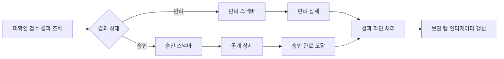

# PV-41 — 검수 결과 알림

## 디자인 참조

- [보관 탭 인디케이터·스낵바·승인 완료 모달](https://www.figma.com/design/WLGPjrQtLqyhq46zXxvXHp/DDD-design-%EC%B0%90?node-id=686-7273&p=f&t=7jXFETjPNUTJ0bx2-11)

> 구현 전 Figma MCP로 프레임 내부의 인디케이터, 승인·반려 스낵바, 승인 완료 모달 노드를 각각 확인한다.

## 결과 안내

- 지도 또는 리스트 화면에서 확인하지 않은 최신 검수 결과를 스낵바로 표시한다.
- 승인 스낵바는 **바로가기** 액션으로 공개된 상세를 연다.
- 반려 스낵바는 **확인하기** 액션으로 반려 상세를 연다.
- 액션 진입 전에 대상 스팟의 최신 상태를 조회한다.

## 보관 탭 인디케이터

- 검수 신청이 진행 중이거나 확인하지 않은 결과가 있으면 하단 **보관** 탭 아이콘에 인디케이터를 표시한다.
- 결과를 확인하기 전까지 유지한다.
- 보관 탭 진입만으로 결과를 모두 확인 처리하지 않는다. 결과 스낵바 액션 또는 대상 상세 확인 시 서버 계약에 따라 확인 완료 처리한다.

## 승인 완료 모달

- 승인 후 작성자가 해당 상세에 처음 진입하면 **스팟 오픈 완료** 모달을 한 번 표시한다.
- 모달 표시 여부는 여러 기기에서도 일관되도록 서버 확인 상태를 우선한다.
- 모달을 닫은 뒤 확인 완료를 기록하며 실패하더라도 상세 이용을 막지 않는다.

## 데이터 흐름

## 파일 매핑

| 파일 | 변경 |
| --- | --- |
| 신규 검수 결과 서비스 또는 `MySpotService` 확장 | 미확인 결과·처리 중 신청 조회, 결과 확인 완료 |
| `feature/home/HomeScreen.kt` | 보관 탭 인디케이터와 전역 스낵바 표시 |
| `feature/map/HomeMapScreen.kt` | 결과 스낵바가 지도 UI와 겹치지 않게 host 연결 |
| `feature/spotlist/SpotListScreen.kt` | 리스트 모드에서도 같은 스낵바 host 사용 |
| `app/navigation/HomeTabRequest.kt` | 보관 탭·특정 상세 이동 요청 전달 |
| `feature/spotdetail/SpotDetailScreen.kt` | 승인 완료 첫 진입 모달과 확인 완료 처리 |

## Stub 구현

- `StubReviewResultService`가 처리 중 신청과 미확인 승인·반려 결과를 공유 상태로 관리한다.
- 개발 fixture에서 승인 또는 반려를 확정하면 지도·리스트·보관함 상태와 알림 상태를 함께 변경한다.
- 결과 확인 명령은 해당 결과만 확인 처리하며 다른 신청의 인디케이터를 지우지 않는다.
- 확인 완료 실패 fixture에서도 상세 화면과 모달 닫기를 막지 않는다.

## API 계약 입력란

| 기능 | Method | Endpoint | Integration Status |
| --- | --- | --- | --- |
| 검수 현황·미확인 결과 조회 | `TBD` | `TBD` | `TBD` |
| 검수 결과 확인 완료 | `TBD` | `TBD` | `TBD` |
| 승인 완료 모달 확인 | 결과 확인과 통합 여부 `TBD` | `TBD` | `TBD` |

| API 기능 | Path Param | Query Param | Request Body | Success Response | Error Codes / 앱 처리 |
| --- | --- | --- | --- | --- | --- |
| 현황·결과 조회 | `TBD` | 미확인 only, page/cursor `TBD` | 없음 | spotId, 결과 상태, 발생 시각, 확인 여부 `TBD` | `TBD` |
| 결과 확인 완료 | resultId/spotId `TBD` | `TBD` | 확인 종류·시각 `TBD` | 남은 미확인 수 또는 성공 status `TBD` | 이미 확인·미존재 `TBD` |
| 승인 모달 확인 | `TBD` | `TBD` | `TBD` | `TBD` | 실패해도 화면 이용 유지 |

검수 결과 전달이 polling, 앱 진입 조회, push 알림 중 무엇인지와 인디케이터를 계산할 서버 필드를 명세에 기록한다.

## 테스트

- 승인·반려 스낵바의 카피와 액션이 구분된다.
- 처리 중 신청과 미확인 결과가 인디케이터를 유지한다.
- 결과 확인 후 인디케이터가 사라진다.
- 스낵바 액션은 최신 상태에 맞는 상세를 연다.
- 승인 완료 모달은 작성자에게 한 번만 표시된다.
- 확인 완료 API 실패가 상세 화면을 막지 않는다.
